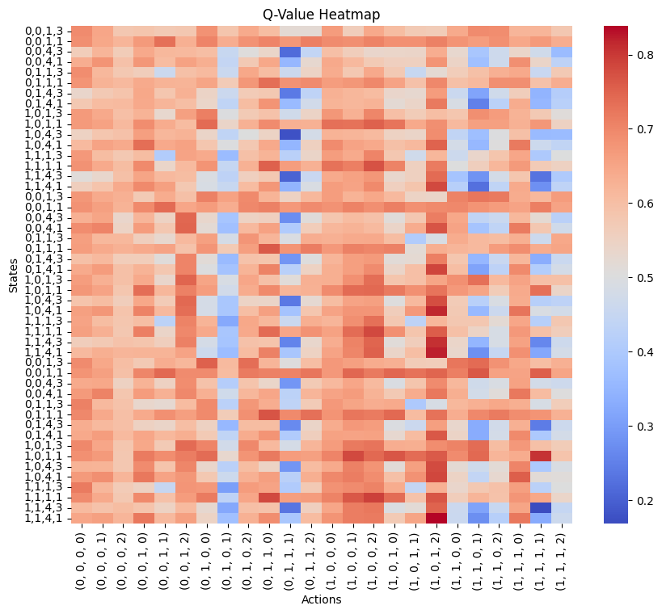

# Capstone_2024

Personal Data Sharing Capstone by Marco Li, Tish Zhou, and Evelyn Feng.

## Project overview

This repository contains code for reinforcement-learning simulations used in *A Game-Theoretic Formulation of Personal Data Sharing*. The work models multi-user data sharing in recommendation systems as an incomplete-information game, and studies Nash equilibria and policy learning under privacy–utility trade-offs.

## Abstract (from report)

While users enjoy personalized services by sharing data to platforms, the increasing societal focus on privacy raises the question of how users can share data strategically without sacrificing service quality dramatically. Prior studies in specialized settings (for example, genomic statistics and IoT) do not fully generalize to broader services with diverse data-use settings and complex user–provider strategic interactions.

This project develops a game model for personalized recommendation services and evaluates it through:

- theoretical analysis,
- fixed-action simulations, and
- Deep Q-Network (DQN) methods.

The study shows optimal stationary user policies and highlights systemic challenges for minority groups, both in random environments and in multi-user strategic (Nash-equilibrium) settings. The framework is intended to provide practical guidance for privacy-conscious users and directions for future research.

## Core learning algorithm

The implementation follows a multi-agent DQN training loop ("MultiDQN2") with the following structure:

1. Iterate over episodes.
2. For each user, initialize environment observation.
3. For each timestep:
   - Select actions for all users (epsilon-greedy for the active learner; greedy for others).
   - Step the environment and collect transition tuples.
   - Update user-specific Q-networks periodically (`T_learn`).
   - Sync target networks periodically (`T_target`).
4. Decay learning rate (`alpha`) and exploration (`epsilon`) across episodes.
5. Return learned Q-functions for all users.

## Reported findings highlight

### DQN in random/fixed populations

- In the average environment with utility preference `w = 0.5`, data-generation frequency `q = 0.3`, and automatic-opponent setting `(0.7, random)`, learned Q-values suggest sharing Category 1 is generally strong across many states.
- In states where most Feature-1 items are already revealed, sharing Category 3 without Category 2 can produce higher reward.
- When data is more scarce (`q = 0.2`), the best actions shift toward higher-sharing strategies, consistent with the hypothesis that users share more when available data is limited.

### DQN in strategic populations (two groups)

- In a two-group setting (5 users per group), the stage-two strategic algorithm does not necessarily increase reward compared with random-population behavior.
- Learned value-function heatmaps indicate users coordinate toward higher data sharing (warmer regions concentrated in lower-right action regions), revealing more data and sharing more categories to achieve higher reward.

## Notes on figure interpretation

The Q-value heatmaps in the report visualize values over:

- **x-axis**: action combinations (data-sharing choices),
- **y-axis**: grouped state categories.

A deterministic policy can be extracted by selecting, for each state, the action corresponding to the warmest (highest-value) heatmap cell.
